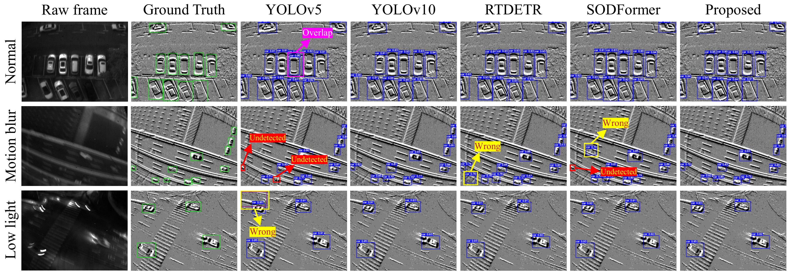

# Event-based Streaming Vision Transformer
Event-based Streaming Vision Transformerfor Challenging Object Detection

Comparison with other state-of-the-art methods

## Conda Installation
We train our models under`python=3.8,pytorch=2.2.2,cuda=11.8`. 

1.  Install Pytorch and torchvision.
Follow the instruction on  [https://pytorch.org/get-started/locally/](https://pytorch.org/get-started/locally/).

`conda install -c pytorch pytorch torchvision`

2.   Install other needed packages
   
`pip install -r requirements.txt`

3.   For more detailed installation steps, please refer to [RTDETR](https://github.com/lyuwenyu/RT-DETR)

# Demo
1. We have put our model checkpoints here [ESVT: Goole Drive](https://drive.google.com/drive/folders/1CONoYjxOX9gsal1bxnj3PmixEKsv3p3L?hl=zh-cn)

2. Please download weights and organize them as following:
weights

&emsp;  └── ESVT/

&emsp;&emsp;&emsp;&emsp;&emsp; └── ESVT-sbfpn-6xd.pth

4.  Run train.py and the results in outputs.
